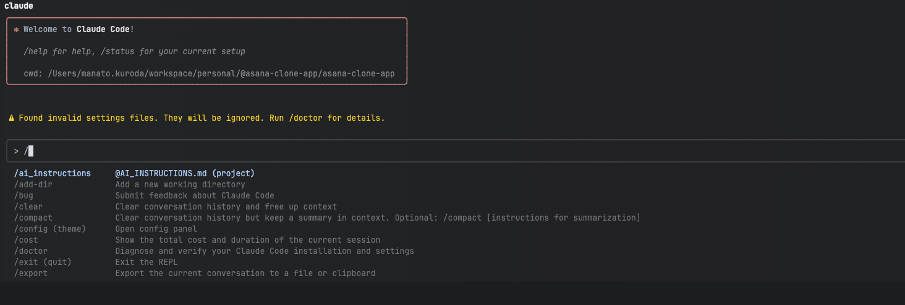

[](https://deepwiki.com/manakuro/asana-clone-app)

# Asana clone app
An Asana clone application for portfolio apps, built with real-time communication with WebSockets and seamless updates with Optimistic UI.

- [Live Demo](https://project-management-demo.manatoworks.me/)
- [Storybook](https://main--63894befbaf58840c037c246.chromatic.com)

## Development Environment
- Node.js 22.17.0
- pnpm 10.13.1

## Installation
```
npm install -g corepack@latest
corepack enable pnpm
pnpm install
```

## Set up a project

Follow the setup documentation for both frontend and backend to configure this project:

- [Frontend Setup](./apps/nextjs/README.md)
- [Backend Setup](./apps/api/README.md)

## Claude Code
To provide instructions for Claude Code, document them in `AI_INSTRUCTIONS.md` and run the `/ai_instructions` command.

### Example

Create the `AI_INSTRUCTIONS.md` file in the root folder and document the instructions like so:

```markdown
## Overview
Please migrate code from Recoil to Jotai.

## Implementation Details
Use commit c491a94f as a reference for this work.

### Target Directory
- apps/nextjs/src/store/entities/task

### Target Files
 - atom.ts
 - hooks folder

### Implementation Notes
- Skip if atom.ts doesn't exist.
```

In Claude Code, run the `/ai_instructions` command.


